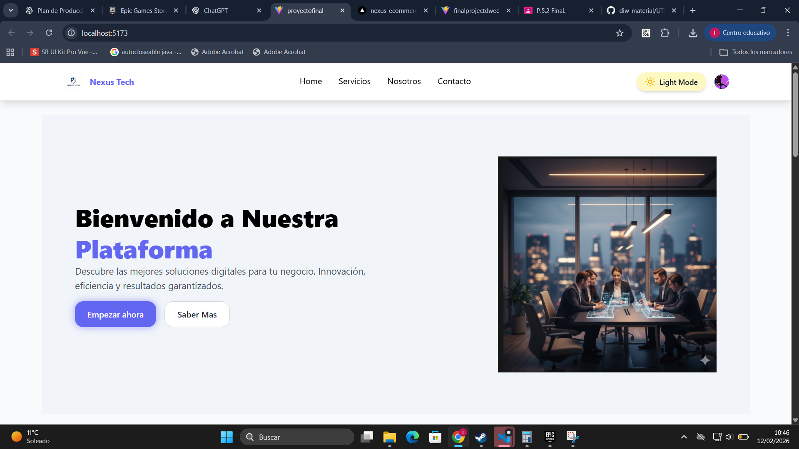
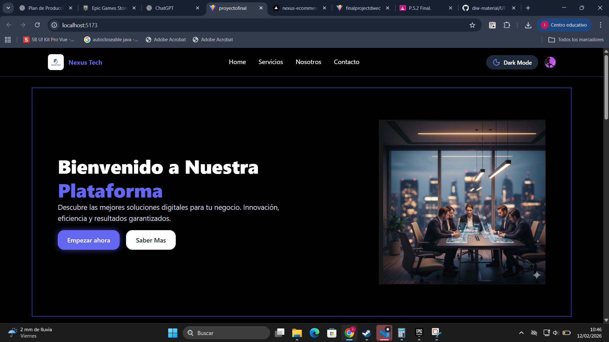

# Plataforma de Soluciones Digitales

## Descripción General

Este proyecto es una plataforma web moderna de presentación (landing page) para un negocio de soluciones digitales. Proporciona a las empresas un espacio profesional para mostrar sus servicios de transformación digital, con una interfaz optimizada, responsiva y con soporte para modo oscuro.

## Capturas de Pantalla

### Tema Claro


### Tema Oscuro


## Propósito del Proyecto

El objetivo principal es crear una presencia digital impactante que permita a la plataforma:

- **Presentar servicios**: Mostrar las soluciones digitales ofrecidas de forma clara y organizada
- **Atraer clientes**: Proporcionar información sobre beneficios y características clave
- **Generar engagement**: Facilitar la interacción mediante llamadas a acción estratégicas
- **Demostrar profesionalismo**: Reflejar calidad técnica mediante un diseño moderno y responsivo

## Características Principales

### Servicios Ofrecidos

1. **Lanzamiento Rápido**: Implementación ágil de proyectos en tiempo récord
2. **Seguridad Total**: Protección completa de datos y sistemas
3. **Análisis Avanzado**: Insights profundos para decisiones empresariales
4. **Soporte Dedicado**: Asistencia continua y especializada

### Capacidades Técnicas

- **Modo Oscuro**: Interfaz adaptable que respeta las preferencias del usuario
- **Diseño Responsivo**: Experiencia óptima en dispositivos móviles, tablets y desktops
- **Integración**: Conexión seamless con sistemas existentes
- **Escalabilidad**: Capacidad de crecer según las necesidades del negocio
- **Optimización**: Rendimiento mejorado y eficiencia operativa

## Estructura Técnica

### Tecnologías Utilizadas

- **Frontend Framework**: React 19 con TypeScript
- **Herramientas de Construcción**: Vite (bundler moderno)
- **Estilos**: Tailwind CSS 4 con soporte para temas
- **Enrutamiento**: React Router v7
- **Autenticación**: Clerk
- **Iconografía**: Lucide React
- **Validación de Código**: ESLint

### Arquitectura de Componentes

```
src/
├── componentes/
│   ├── Header.tsx          # Navegación principal
│   ├── Hero.tsx            # Sección de bienvenida
│   ├── Cards.tsx           # Galería de servicios
│   ├── NegocioDigital.tsx  # Información del negocio
│   ├── Estadisticas.tsx    # Métricas y datos
│   ├── Preparacion.tsx     # Sección de preparación
│   ├── Footer.tsx          # Pie de página
│   ├── Button.tsx          # Componente reutilizable
│   ├── Card.tsx            # Componente reutilizable
│   └── ThemeToggle.tsx     # Control de tema
├── pages/
│   └── Home.tsx            # Página principal
├── hooks/
│   └── useDarkMode.ts      # Lógica de modo oscuro
└── assets/                 # Recursos visuales
```

## Secciones de la Plataforma

### 1. Header
Componente de navegación fijo que mantiene acceso a opciones principales incluso durante el scroll.

### 2. Sección Hero
Introducción impactante con:
- Mensaje de bienvenida principal
- Descripción propuesta de valor
- Botones de acción para "Empezar ahora" y "Saber Más"

### 3. Servicios Principales
Grid de cuatro tarjetas que presentan:
- Titulo y descripción de cada servicio
- Imágenes representativas
- Diseño limpio y escalable

### 4. Negocio Digital
Sección que explica el posicionamiento de la plataforma mediante:
- Información visual con imagen de contexto
- Características clave: Optimización, Integración, Escalabilidad
- Estructura lado a lado para máximo impacto

### 5. Estadísticas
Sección de métricas que demuestran el valor y alcance de la plataforma.

### 6. Preparación
Sección que motiva a los usuarios a dar el siguiente paso.

### 7. Footer
Información de contacto, enlaces y cierre de la página.

## Experiencia de Usuario

### Responsividad
- **Mobile-First**: Diseño optimizado para dispositivos móviles
- **Breakpoints**: Adaptación visual en tablets (sm/md) y desktops (lg)
- **Imágenes**: Manejo inteligente de recursos según el tamaño de pantalla

### Accesibilidad Visual
- **Tema Claro y Oscuro**: Sistema de temas integrado con preferencias del usuario
- **Contraste**: Paleta de colores diseñada para legibilidad
- **Iconografía**: Uso de iconos para mejorar la comprensión visual

## Stack de Desarrollo

- **Lenguaje**: TypeScript (type-safe)
- **Build Tool**: Vite (desarrollo rápido)
- **CSS Framework**: Tailwind CSS (utilidad-first)
- **Package Manager**: npm
- **Control de Calidad**: ESLint configurado

## Scripts Disponibles

- `npm run dev`: Inicia servidor de desarrollo
- `npm run build`: Compilación de producción optimizada
- `npm run lint`: Análisis de código con ESLint
- `npm run preview`: Visualización de la build de producción

## Objetivo Final

Este proyecto materializa una plataforma de soluciones digitales que combina:
- **Presentación profesional** de servicios
- **Experiencia moderna** con React y TypeScript
- **Diseño responsivo** que funciona en cualquier dispositivo
- **Flexibilidad visual** mediante temas personalizables

Es una base sólida para una plataforma de negocio digital que puede expandirse con funcionalidades adicionales como formularios de contacto, integraciones de API externas, o sistemas de gestión de contenido más complejos.
